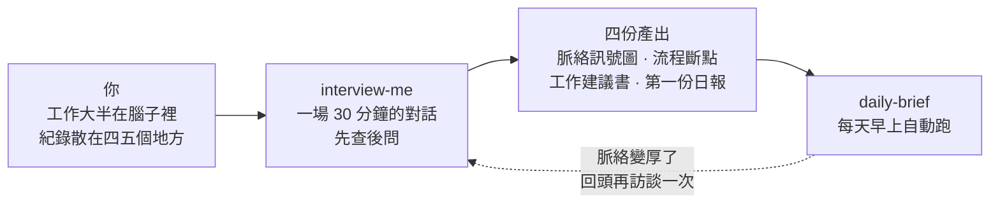
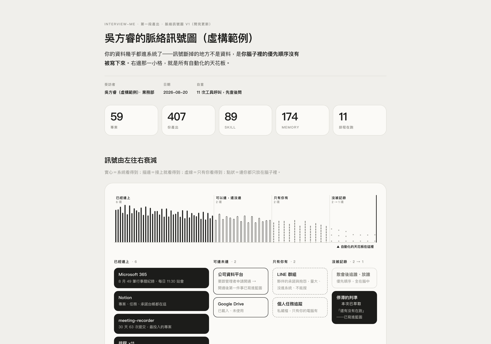
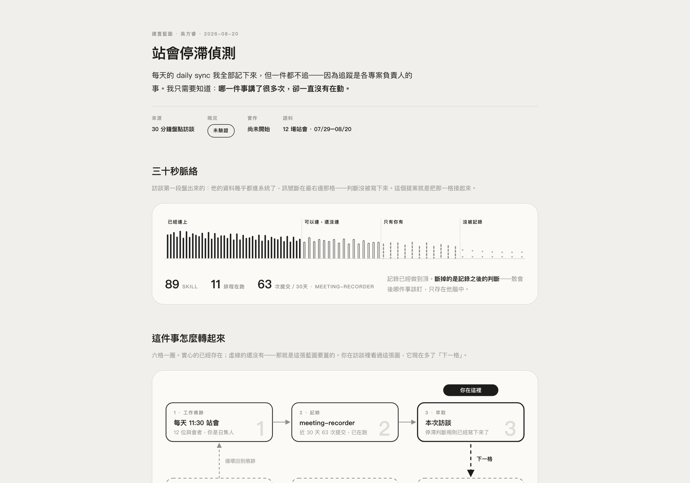
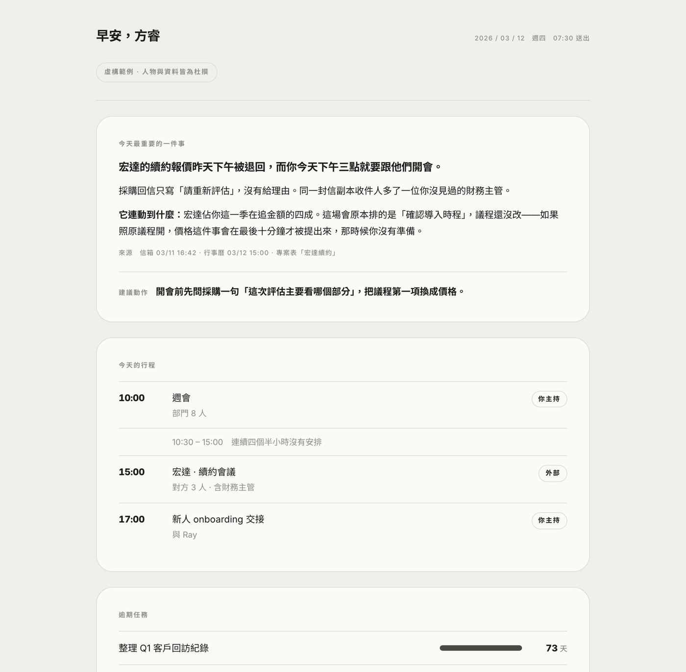

# 減法工作流 · 兩個 Skill

> 「明確目的、梳理脈絡、建立系統。」
> —— 陳致瑋 Nelsen，2026 台灣行銷年會《AI 時代的減法工作流》

這裡放兩個可以直接用的 skill。它們處理同一件事的兩半：**先讓 AI 真的認識你的工作，再讓它每天早上把該你管的事整理好給你。**

[](NOTICE.md)
[](NOTICE.md)
[](NOTICE.md)

方睿科技（FUNRAISE）出品。

---

## 30 秒開始

**把下面這段整段複製，貼給你的 AI（Claude、ChatGPT、或任何你在用的 agent）：**

```
請到 https://github.com/Nelsen-funraise/context-interview 讀 README，
把 interview-me 和 daily-brief 這兩個 skill 都安裝到我的環境，
裝好之後用 interview-me 開始訪談我。
```

它會自己讀完、把**兩個都裝好**、然後開始問你問題。**兩個要一起裝** —— 訪談的第四步會直接產出你的第一份每日簡報，那一步就是 `daily-brief` 在做的事。

**你不需要先準備任何東西**——它會先自己查，查不到的才問你，而且每一題都給你選項，點一下就好。

三十分鐘後你會拿到四樣東西：你的脈絡訊號圖、工作流程的斷點、一份工作建議書，還有你自己的第一份每日簡報。

> 如果你的 AI 說它讀不了網址，往下看〈**安裝**〉那一節，有三種環境的手動做法。

---

## 這是什麼

大部分人用 AI 用得不順，是因為一直在做加法：學更多工具、把提示詞寫得更長、再去上一堂課。

這兩個 skill 是**減法**的實作。年會那場講的三個減法，對應到具體的東西：

| 你以為要加的 | 其實該做的 | 這裡怎麼實作 |
|---|---|---|
| 把提示詞寫得更細 | **講清楚目的，手段交給它** | 訪談只問你要什麼結果，不問你想用什麼工具 |
| 餵更多資料給 AI | **累積脈絡，減少迭代** | 一次深度訪談，之後每個對話都從你的脈絡開始 |
| 學更多工具 | **建立系統，減少重複** | 訪談的產物會一直被下一個 AI 讀到，不用重講 |

一個算式：

```
Purpose（質化成果 ＋ 量化指標）  ×  Context（來源 ＋ 工具）
```

**是乘法不是加法。** 只有目的、沒有脈絡，AI 給你的是網路上人人都查得到的答案；只有脈絡、沒有目的，它很懂你但不知道要幹嘛。任何一邊是零，結果就是零。

---

## 兩個 skill 怎麼接



**interview-me** 是入口，只跑一次（之後想更新再跑）。
**daily-brief** 是它第四步的產物，跑起來之後每天自己動。

---

## interview-me：一場會問對問題的訪談

### 它怎麼問

**先查後問。** 開場它先花幾分鐘翻你已經連上的資料（行事曆、任務、筆記、信箱——你給它什麼它看什麼），翻得到的就不問你。

**問題附選項。** 它不會丟一個空白的開放式問題給你。每一題都先猜好三到五個選項，還會標出它猜哪一個，你點一下就好——永遠留一格「都不是，我自己說」。

**講回去給你聽。** 每畫一張圖，它不是問你「這樣對嗎」，而是先用你的日常把圖翻譯一遍，再問一個具體的是非題。你糾正它的那句話，就是整場訪談最有價值的輸入。

> 這叫**雙向費曼**：有問、有答、有重述。這是它跟一般問卷式訪談最大的差別。

### 四步、四樣產出

| 步 | 它做什麼 | 你拿到什麼 |
|---|---|---|
| 1 | 把你連得上的來源攤開，問三件事：**有什麼可以連還沒連？有什麼只有你看得到？有什麼在你腦子裡、連你自己都沒寫下來？** | **脈絡訊號圖** |
| 2 | 順著你一天的流程走一遍，找出斷在哪 | **流程斷點** |
| 3 | 從你一週花四小時以上的事開始，小步快跑 | **工作建議書** |
| 4 | 用剛剛查到的材料排版 | **你的第一份每日簡報** |

### 兩種長度

- **完整版 30 分鐘**——五站走完。
- **快閃版 10 分鐘**——只問關鍵題，一樣交一份記錄頁。

不管哪一種，**第 60 秒就會給你第一張圖**，哪怕上面還有問號。先給再要，你才知道值不值得繼續。

### 產出長在哪

**一份會長大的頁面。** 不是訪談時寫筆記、最後另外做一份報告——是同一份東西，從第 60 秒開到收尾。

它同時給兩種讀者看：**人**看得懂、可以直接轉給主管；**下一個 AI** 讀得懂，三個月後你說「繼續上次的訪談」，那個 agent 讀這一份就能接下去，不用重問。

落在哪取決於你的環境：能寫檔就寫成 `.html`；只有畫布或 artifact（多數網頁版使用者在這一層）就產一個並**整場更新同一份**；兩者都沒有就把完整原始碼給你，複製存檔就能打開。

---

## daily-brief：每天早上的一頁

固定四塊，加上你自己選的模組。

1. **今天最重要的一件事**——只有一件。包含發生了什麼、來源是哪裡、**它連動到什麼**（這是最有價值的部分），最後給一句具體建議。找不到夠格的就誠實說今天沒有特別的，不硬湊。
2. **今天的行程**——標出你是不是主持人、空檔在哪。
3. **逾期任務**——依天數排序。逾期超過 60 天的會被點出來，因為那通常代表狀態沒更新，不是進度落後。
4. **透明度區塊**——讀了什麼、沒讀什麼、怎麼停、這一版不會要你做任何事。

最後那塊不是客套。**你要先信得過它，才會每天打開它。**

視覺走單色編輯風：量級用長度編碼、不用顏色，所以色盲、灰階列印、深色模式下都一樣讀得懂。

> **沒接任何公司系統也能跑。** 只有行事曆就從行程本身找頭條；什麼都沒接，就改成一頁「你自己說過的事」——從訪談記錄裡撈你講過的每週重複工作。**它不會用常識填版面**：沒讀到行事曆就不會寫「你今天有三個會」。

---

## 先看看你會拿到什麼

以下三份都是**虛構範例**——人物「吳方睿」與所有資料都是杜撰的。
每一張都可以[**打開互動版**](https://nelsen-funraise.github.io/context-interview/)（真的頁面，不是圖片）。

### 1. 脈絡訊號圖

訊號由左往右衰減：**已經連上 → 可以連還沒連 → 只有你看得到 → 沒被記錄**。
最右邊那一格就是所有自動化的天花板——它不是資料問題，是「只在你腦子裡」的東西還沒被寫下來。

[](https://nelsen-funraise.github.io/context-interview/interview-me/examples/context-map.html)

### 2. 工作建議書

訪談挖出來的判斷規則、例外、閉環斷在哪，加上**一個十分鐘內做得完的第一步**。
可以直接轉給主管或同事看。

[](https://nelsen-funraise.github.io/context-interview/interview-me/examples/blueprint.html)

### 3. 每日簡報

訪談第四步當場產出，之後每天早上自己更新。
量級用長度編碼、不用顏色——所以灰階列印、深色模式、色盲都一樣讀得懂。

[](https://nelsen-funraise.github.io/context-interview/daily-brief/examples/daily-brief.html)

---

## 安裝

### A. Claude Code / Cursor / 任何讀得到本機檔案的 agent

```bash
git clone https://github.com/Nelsen-funraise/context-interview.git
cp -R context-interview/interview-me  ~/.claude/skills/
cp -R context-interview/daily-brief   ~/.claude/skills/
```

然後說：**「訪談我」**。

### B. Claude.ai 網頁版

網頁版要上傳 zip。**已經幫你打包好了，點了就下載：**

- [**interview-me.zip**](https://github.com/Nelsen-funraise/context-interview/releases/latest/download/interview-me.zip)
- [**daily-brief.zip**](https://github.com/Nelsen-funraise/context-interview/releases/latest/download/daily-brief.zip)

然後：claude.ai → 左下角你的名字 → **Customize** → **Skills** → 右上 **Add** → **Upload skill** → 選剛下載的 zip。兩個各做一次。

開新對話說：**「訪談我」**

> 網頁版不會在你電腦上留檔。記錄頁會做成一個 artifact，訪談結束記得**下載下來**——下次說「繼續上次的訪談」時貼回去就能接著談。

### C. 其他 AI（ChatGPT、Gemini、或任何吃長提示詞的）

沒有 skill 機制也能用：開一個新對話，把 `interview-me/SKILL.md` **全文貼進去**，說「照這份流程訪談我」。

它查不到你本機的東西，所以地圖那一段會多用幾題問你——其餘流程一樣。

---

## 架構

```
interview-me/
  SKILL.md                    主檔。駕駛規則、五站路線、開場、收尾
  profiles/
    solo.md                   你自己一個人用（沒有公司資料入口）
    internal.md               公司同事用（查得到組織的系統）
    course.md                 課程學員用
  references/
    interview-protocol.md     怎麼問：追問、案例回放、推規則回去
    interview-record.md       記錄頁規格（會長大的那一份）
    visual-language.md        四張圖的時機與畫法、交圖時怎麼講回去
    plain-talk.md             說人話手冊：換詞表、三個測試
    output-templates.md       產出的模板
    closing-deliverables.md   收尾要交什麼
    modes.md                  自訪 / 協助訪談 / 累積模式
    organization-context.md   ← 要導入自己公司，只改這一份
  examples/                   虛構範例

daily-brief/
  SKILL.md                    主檔。骨架四塊、沒有資料源時的最小可用版
  references/
    setup.md                  第一次設定
    sources.md                來源怎麼接、讀不到時怎麼說
    modules.md                可選模組清單（唯一出處）
    profile.md                個人設定檔
    visual-spec.md            單色編輯風規格
    plain-talk.md             說人話手冊
    brands.md                 品牌 token 覆蓋
  examples/                   虛構範例
```

**一條原則**：訪談方法本身跨組織通用，**只有 `organization-context.md` 需要改成你們公司的**。名冊在哪、用什麼查人、你們自己的資料入口是什麼、每個部門的工作痕跡在哪。

沒填也能跑——訪談會自動走 `profiles/solo.md`，全部用問的。只是「能查就不問」這一半的體驗會少掉。

---

## 授權

**CC BY-NC 4.0**（姓名標示 — 非商業性）。白話講：

| | |
|---|---|
| ✅ **自己用、給同事用、改成你們團隊的版本** | 免費，不用問我們 |
| ✅ **分享、轉貼、寫成文章** | 請註明出處：方睿科技 FUNRAISE，並附上這個 repo 的連結 |
| ⚠️ **商業使用**（收費課程、顧問交付物、包進你的產品、對外販售） | 需要另外談授權或分潤 |

商業授權怎麼申請，見 [`NOTICE.md`](NOTICE.md)。完整條文見 [`LICENSE`](LICENSE)。

---

## 出處

出自方睿科技「AI Raiser 先鋒計畫」，2026 台灣行銷年會《AI 時代的減法工作流》現場釋出。

「每答一題就存檔」的做法，參考自 Nate Herk 的 grill-me（原始版本為 Matt Pocock 所作）。

---

<sub>© 2026 方睿科技股份有限公司 FUNRAISE Inc. · CC BY-NC 4.0</sub>
